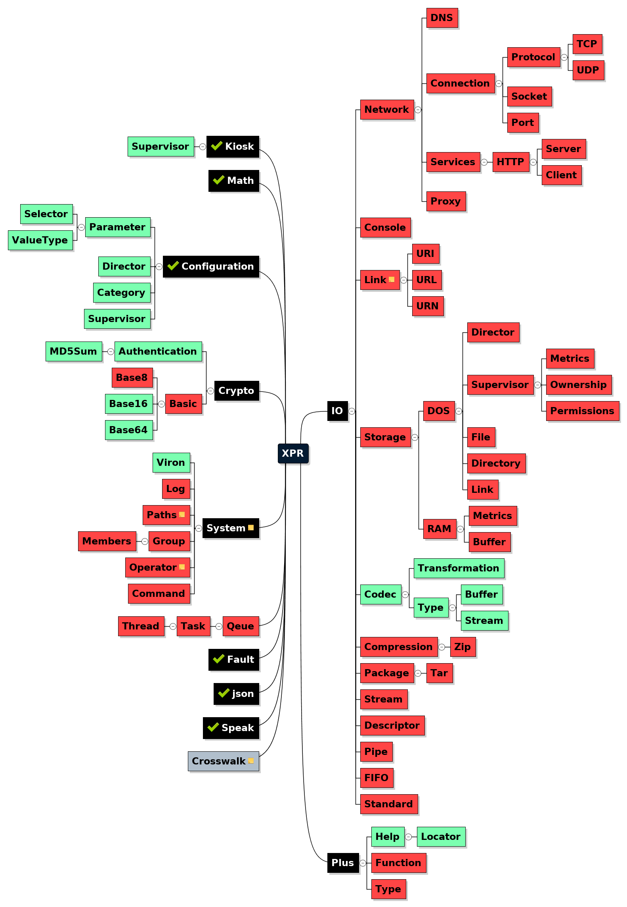

Welcome to the world-contribution-java-source-code-bank for [Hypersoft Krypton](https://www.github.com/hypersoft/Krypton).

This code-bank is for Java Coders who wish to extend = (study and/or modify) the platform functionality of 
Krypton, or those who wish to fork Krypton's power features in their own 
java-software-code-works. Please see [LICENSE](LICENSE) for data on any 
permissions you may need for your public-code-works.

Coding Platform:

 * Gradle
 * Netbeans Mind Map
 
Suggested IDE: IntelliJ-IDEA 2017 or greater; with Gradle, and Netbeans Mind Map
(plugins).

<h5>XPR: A Logical Software Architecture Map</h5>

  <i><small>This data may, or may not be concurrent with the 
software within this code-bank and is subject to change with no warnings or
notices. [architecture = not a real schematic]</small></i>

<h5>Notice</h5>

Krypton is not currently using this code-bank.
The code-bank that Krypton currently uses is being outsourced to this code-bank.

You should feel free to hack-on and rip-from this code however you like, but 
you should not plagiarize any code you have been given. Which means claim 
someone's work as your own original work. In general, you may take 
parts and pieces you need [everything in the cosmos is constructed of similar parts], however that's not really something you need to do if
you use XPR in the context it was made for.

<h5>Contributing</h5>

All useful contributions are welcome. "Useful" means any technology, or comments
 [thoughts], which meet the goals of XPR as laid out in the XPR Logical 
 Architecture Map.

As far as contributions go, what this code-bank really needs are code testers, 
platform-feature-compatibility-pull-(requests = direct-code-bank-patches) and people who like to whine, 
"protest" and complain about things <b>not working</b> in a way perceived to be 
logical (introspective reflections; simple-analytical-hypothesis resulting in random-consequence = "unexpected output"). If you find that something is not working,
and you cannot correct the issue on your own, please feel free to 
[file an issue](issues) on the problem you are having.

On the other hand, if you can correct a software issue, we would love to see 
your pull requests under the terms of share-and-share-alike (world-contribution for
world-contribution). If you don't comprehend the concept of pushing and pulling to 
and from online code-bases, you can always use good 'ol markdown syntax in 
conjunction with your favorite [Gist](https://www.gist.github.com) or 
[Pastebin](https://www.pastebin.com) and our [issues](issues) site, to submit 
your features, and fixes like a no-(non-sense/hassle)-coding-guru would.

Do you believe you have found a copyright or licensing issue concerning this
software? If you have You should go to the issues page and post a comment int 
the [Licensing](https://github.com/hypersoft/XPR/issues/1) issue.

Perhaps you have a suggestion? Why wait? Go to the 
[Suggestions](https://github.com/hypersoft/XPR/issues/1) issue and post a 
suggestion.

Something is missing? That sounds interesting enough. However, the case seems 
likely that; at this point, you should already have the 
[gist](https://www.gist.github.com) on filing [issues](issues) or other 
features you might be having/wanting.

<h3>What's in a name?</h5>
<h5>'Ol Unix C Standard Naming Conventions</h5>
Lazy. You practically might as well be writing machine code. Off the top of your
head, can you tell me what <code>dtoa, ftoa, fprint, printf, sprintf, malloc,
wcstomblen</code> mean? I know what all of these crypto codes mean. It means
learning a third-language to perform instructional speech in a second-language
which is translated into the primary (first) language[=machine-code]. Does the term lost in translation,
mean anything to you? You have to learn all of these languages to communicate
effectively with the hardware. Its not clear, and it certainly is not concise.

What generally happens is, most coders never see all of the logical connections,
and thusly their code is not very straight forward. Do you have to be, a
rocket-scientist to comprehend, that this situation is not ideal for
instructional purposes? What is the primary goal of writing software? Performing
computations through instructional machine interfaces. What is the primary goal
of writing a software-language? If you did not say "human-interface-device" you
got it wrong. Luckily you don't have to try again.

<h5>Java Naming Conventions</h5>
Java users recommend the <code>camelCaseNamingConvention</code> for Class fields
 and methods AKA properties. Java Classes use <code>TitleCaseNamingConventions
 </code> and packages use <code>lowercasenamingconventions</code> This is so that your code has a clear and consistent meaning that does
  not require source Browsing for Human Cognition in relation to identifier
  scope and context. That's a really neat trick.

<h5>XPR Naming Conventions</h5>
Nearly everything in user-land is first-class in XPR, which means
<code>TitleCaseNamingConventions</code>, and <code>Hierarchial.Context.Class.Nesting</code>. What is not first-class? Auxilliary
support. (Primitive = Simple = Portable) Constants are <code>JUMBO_CASE</code>. 
Getters/Setters and instance[=structured-class-data]-storage-variables are 
<code>camelCase</code> if the class-data is not a Singleton[=first-class-variable]. Lastly, abbreviations = known-compound-word-briefs are SUPERCASE such as in <code>XPR</code>.
 
 
<small><cite>commentary</cite></small> 
Logically Input, is always greater than output, because the output doesn't 
exist without the Input. We are not concerned with what the user is thinking,
we are concerned with the logic of operations. Which means actually writing code
that looks well, and performs well in terms of getting from A TO B for a particular
goal.

Clear and Concise should always be the goal for an API. Even if that means
writing up your own naming convention, [in this case] particularly when the 
common-practice is not up to par with logic (computational language).
 
The difference between machine code and compiled code is simple in terms of
communication. Its all in the name game. Monikers rule the day. If you use the
correct-logic, you will get the correct output, but you won't always have the
correct logic if you write code with (incorrect = not: correct) language. 
Correct language [in software coding] means your variable-lables are written with
correct-word-construction.

"What is in a name" [in terms of software-coding]; doesn't
get any simpler than that last paragraph.
  
<cite><small>on correct-aenglish[=computational-logic: english]-langauge-word-construction</small></cite> 
Generally in logical Aenglish word construction 
<code>/^(pr[aeiou]|in|ir|im|un|de|re|a)*$/i</code> are void-fact-word-constructions (word constructions with meaning-values of void-facts = fictions) because
the "prefix" is voiding the fact of the following word with the negative modification of the
word, with no closure for the fact = (+/- = plus or minus [the value of the following fact/fiction/ideal = (+/- = plus or minus [the value of any following suffix = (+/- = plus or minus)])=random-(verb-function=word-hashing=cryptogram)]):
    
    process
    prefix 
    independent
    irresponsible
    immature
    unlikely
    dependent
    retarded
    asymptomological

<small>
<i>The void pr is with the cause of wrong vowel and syllable speech-[e-]jection[= (putting forth)/(taking with)]</i>.

Lack of certainty is not logical.
</small>

For good measure, here is a correct conveyance for the logic of the foregoing terms:

    system
    fixation 
    sovereign
    lacking[=without] honor
    with the lack of culturing
    beyond the scope of comprehensive possiblity
    operating with the support of a fact
    many meanings: lacking-cognitive-capacity, elementary, behind, etc.
    lacking the symptons of a model diagnosis
    
The "unhashing" of the words is a technical-art of [en]vironmental-circumstances.

negative-word-modification-logically-means: not [the = a] fact is the sum[=fiction [using our foregoing tables: (not a system is a process) = BACKWARDS; a negative has no parity with a positive; and we know the "process" is a negative-performance-pledge]]. Some words start with void-fixes 
like (refuse; with the meaning of garbage or trash, rather than "decline"(which 
means to modify a (offer = clination) negatively), but those words have no 
fixation. Here is a quick code sample you should study.
 <code>Input</code> = <code>InPut</code> the correct-word-form and 
 software-variant-label-construction is <code>SourceData, sourceData or SOURCE_DATA</code>.
For any combination of nouns, the formal-correct-spelling is with the 
hyphenation of the words, thusly forming a 
<code>single-compound-word</code> = 
 <code>SingleCompoundWord, singleCompoundWord or SINGLE_COMPOUND_WORD</code> 
 because hyphenation is forbidden by most software-coding-language-tools.

Words like "com" are commonly considerable as "prefix words", but com doesn't 
mean negative modification, com means "with", Such as in Community, Computer, or
Compound. Words which subtract from the meaning must possess a negative-fact-sum
, such as in delete, recycle, or unlink; all of which [commonly within the computing domain] mean perform file 
(refuse = trashing) methods.

In addition to void fixes there are void: (Vowel and Syllable)-compositions for 
the beginning of a word:
 
    (1) If the root-word is longer than three letters [without suffixation ]and
        if the word in question starts with a vowel:
       
        (a) the third letter of the root-word must also be a vowel if the 
            second-letter of the root-word is not a vowel;
  
        (b) the first vowel of the root-word cannot be followed by a 
            phonetic-[e]nunciation-break. [such as in E-nunciation]
        
    [vow: means to pledge; el: means contract; and a contract must be a known fact]
    [these word constructions violate the (syllable/consonant)-grammar-contracts[=word-meanings of syllable and consonant];]
    [which violates the value of the conveyance = (word being constructed): meaning ambiguous = without-certainty = lacking-clarity: mathematically-random-data]
    [otherwise: pledging a void contract = fictional-fact-statement]
    

Correct sentence grammar construction, time-modification-words, and fact-modification-words[=adverbs, adjectives] and psuedo-facts[=pronouns] are beyond the scope of this documentation, as well as our goal of keeping the documentation "available for standard english readers".
In our theorhetical software writing cause, we are operating a 
fact-calculation-contrivance (that is to say: computer and software coding tools) 
which has its own sentence grammars within this domain of code-writing, and 
all (notions = clinations = suggestions) of time are relative. Furthermore: Aenglish because English 
starts with a vowel, doesn't continue with a vowel, and the third letter is 
not a vowel.

It also helps to tell you that you can construct your words however you want if 
you give the correct meaning for the (incorrect = wrong) term; no closure of terms
in matters of logic, means no logical contract/comprehension/knowledge of a fact.
The Human Mind, <strikeout>also</strikeout> has its own term mapping features. This commentary has 
been about correctly operating those features in the context of computational 
[high-order] logic language [extensions] for software (development = coding).

<small><b>The Fine Print</b></small>
  
<small>This document and all documentation within this code-bank are written for
"standard-english" reading audiences; multi-national-translations and 
quantum-communications-forms: notwithstanding[=meaning: does not apply to this 
claim].</small>
  
<small>Be forewarned of knowledge: A right is a state of being correct, and or a
direction. [100%-FACT]</small>
  
<small>This software-code-bank is (C) Hypersoft-Systems: U.-S.-A.; ~December: 
2017 THROUGH THE NOW-TIME WITH THE TERMS AND CONDITIONS IN THE WRITINGS OF THE 
DOCUMENTS. FOR THE TAKING AND PUBLISHING OF THE CODE-SOURCES WITHIN THE
PUBLIC-DOMAIN IS WITH THE COPY-RIGHTS THROUGH THESE DOCUMENTATION-COPY-CLAIMS
OF THIS WORLD-CONTRIBUTION-JAVA-SOURCE-CODE-BANK.
</small>