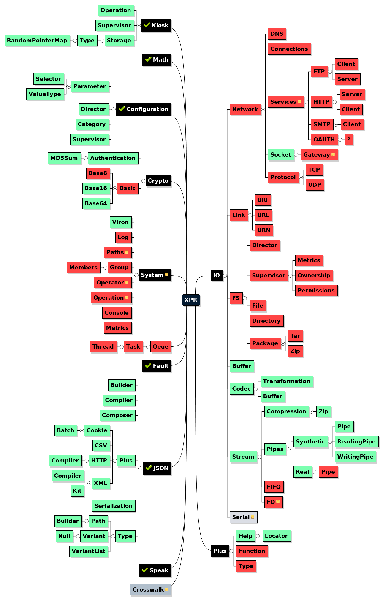

Welcome to the open-contribution-java-source-code-bank for [Hypersoft Krypton](https://www.github.com/hypersoft/Krypton).

This code-bank is for Java Coders who wish to extend the functionality of 
Krypton, or those who wish to fork Krypton's power features in their own 
java-software-code-works. Please see [LICENSE](LICENSE) for data on any 
permissions you may need for your public-code-works.

Development Platform:

 * Gradle
 * Netbeans Mind Map
 
Suggested IDE: IntelliJ-IDEA 2017 or greater; with Gradle, and Netbeans Mind Map
(plugins).

#####XPR: A Logical Software Architecture 

  <i><small>This data may, or may not be concurrent with the 
software within this code-bank and is subject to change with no warnings or
notices.</small></i>

#####Notice

Krypton is not currently using this code-bank.
The code-bank that Krypton currently uses is being outsourced to this code-bank.

You should feel free to hack-on and rip-from this code however you like, except 
that you should not plagiarize any code you have been given. Which means claim 
someone else's work as your own original work. In general, it is okay to take 
parts and pieces you need, however that's not really something you need to do if
you use XPR in the context it was made for.

#####Contributing

All useful contributions are welcome. "Useful" means any technology, or comments
 [thoughts], which meet the goals of XPR as laid out in the XPR Logical 
 Architecture Map.

As far as contributions go, what this project really needs are code testers, 
platform-feature-compatibility-pull-requessts and people who like to whine, 
protest and complain about things <b>not working</b> in a way perceived to be 
logical. If you find that something is not working correctly with this software,
 and you cannot correct the issue on your own, please feel free to 
 [file an issue](issues) on the problem you are having.

On the other hand, if you can correct a software issue, we would love to see 
your pull requests under the terms of share-and-share-alike (open-contribution for
open-contribution). If you don't comprehend the concept of pushing and pulling to 
and from online code-bases, you can always use good 'ol markdown syntax in 
conjunction with your favorite [Gist](https://www.gist.github.com) or 
[Pastebin](https://www.pastebin.com) and our [issues](issues) page, to submit 
your features, and fixes like a no-(non-sense/hassle)-coding-guru would.

Do you believe you have found a copyright patent or licensing issue? You should 
go to the issues page and post a comment under the 
[Licensing](https://github.com/hypersoft/XPR/issues/1) issue.

Have a suggestion? Why wait? Go to the 
[Suggestions](https://github.com/hypersoft/XPR/issues/1) issue and post a 
suggestion.

Something is missing? That sounds interesting enough. However, the case seems 
likely that; at this point, you should already have the 
[gist](https://www.gist.github.com) on filing [issues](issues) or other 
features you might be having/wanting.

<small><b>The Fine Print</b></small>
  
<small>This document and all documentation within this code-bank are written for
"standard-english" reading audiences; multi-national-translations and 
quantum-communications-forms: notwithstanding[=meaning: does not apply to this 
claim].</small>
  
<small>Be forewarned of knowledge: A right is a state of being correct, and or a
direction. [100%-FACT]</small>
  
<small>This software-code-bank is (C) Hypersoft-Systems: U.-S.-A.; ~December: 
2017 THROUGH THE NOW-TIME WITH THE TERMS AND CONDITIONS IN THE WRITINGS OF THE 
DOCUMENTS. FOR THE TAKING AND PUBLISHING OF THE CODE-SOURCES WITHIN THE
PUBLIC-DOMAIN IS WITH THE COPY-RIGHTS THROUGH THE COPY-TERMS.</small>